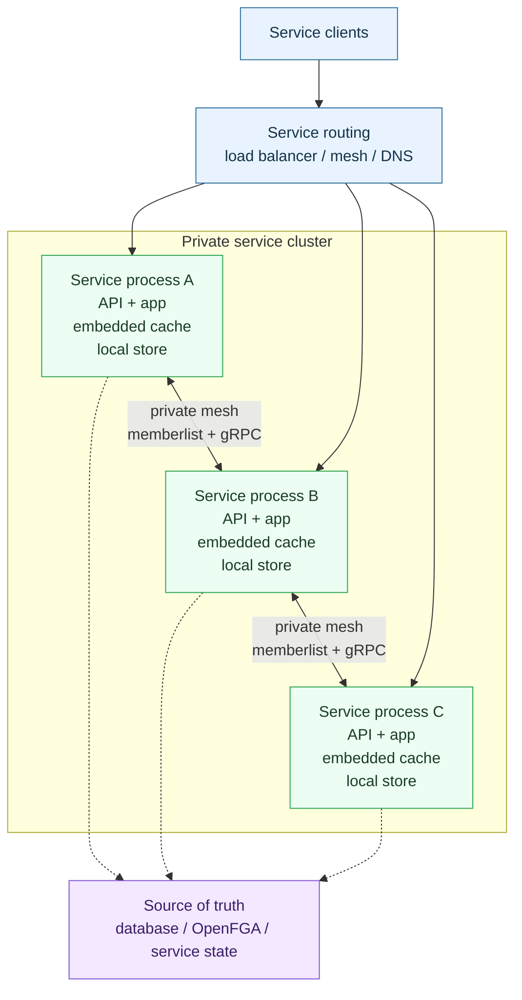

# Distributed Cache

An embedded distributed cache for Go services.

`distributed-cache` gives each service replica an in-process cache API while the
replicas coordinate ownership, replication, deletes, and repair through a
private node-to-node control plane.

```go
import dcache "github.com/infamousity/distributed-cache/cache"

c, err := dcache.Start(dcache.Options{
  NodeName:             "service-1",
  ControlBindAddr:      "10.0.0.12",
  ControlBindPort:      9090,
  ControlAdvertiseAddr: "10.0.0.12:9090",
  GossipBindAddr:       "10.0.0.12",
  GossipBindPort:       8946,
  PeerNodes:            []string{"10.0.0.10:8946"},
  SharedKey:            "super-secret",
  ReplicationFactor:    3,
})
if err != nil {
  panic(err)
}
defer c.Close()
```

## What It Is

- an in-process Go cache library
- a memberlist-backed cache cluster
- a consistent-hash ownership ring
- a replicated cache with tombstones for deletes
- a private gRPC control plane between cache nodes
- a runtime-neutral module with Docker Swarm and Kubernetes examples

## What It Is Not

- not a Redis protocol replacement
- not a standalone public cache gateway
- not a database or durable source of truth
- not an external service API
- not a substitute for service-level authn, authz, validation, or audit

The host service owns its public API. This module owns only the embedded cache
API and the private cache-node control plane.

## Why Use It

Use this cache when a Go service needs cache locality, horizontal replicas, and
cross-replica cache sharing without adding a separate Redis-like service to the
runtime.

It is a good fit for:

- derived authorization data
- service-local materialized views
- expensive lookup results
- soft-state data that can be rebuilt
- private service clusters where replicas can communicate directly

Prefer Redis or another external cache when you need:

- a language-neutral cache endpoint
- broad client compatibility
- mature persistence options
- centralized operations and visibility
- cache access from services that cannot join the private cache network

## Architecture



Each process embeds the cache. Memberlist handles membership and gossip.
Consistent hashing chooses key owners. gRPC is used only for private
node-to-node fetch, store, delete, ping, and repair operations.

## Core Features

- Ristretto-backed local cache storage
- key ownership through consistent hashing
- configurable replication factor
- namespace-aware `Get`, `Set`, and `Del`
- TTL support per write
- majority write concern for stronger invalidation paths
- tombstones to prevent stale delete resurrection
- read repair and background anti-entropy
- static peer lists or DNS peer refresh
- startup readiness checks
- gRPC health endpoints
- optional Prometheus metrics
- shared-key authentication for gossip and control-plane traffic
- optional TLS and mTLS-ready configuration

## Runtime Contract

The cache is runtime-neutral. A deployment only needs to provide:

- stable unique node names
- peer-reachable memberlist gossip addresses
- peer-reachable gRPC control-plane addresses
- static peer discovery or DNS peer discovery
- private TCP/UDP reachability between cache nodes
- the same shared key on every node

Do not publish gossip or gRPC control-plane ports externally.

See [Runtime Profiles](runtime-profiles.md) for Docker Swarm, Kubernetes,
Podman, systemd, and VM guidance.

## Docker Swarm

The Swarm example runs a replicated service where each task embeds a cache node.
It uses task-level DNS discovery and an internal overlay for cache traffic.

```bash
cd examples/swarm
DOCKER_CONTEXT=default ./chaos.sh
```

Key points:

- use `tasks.<service>` for peer discovery, or `peer_dns_names` when peers span
  multiple connected stacks or services
- bind gossip and control-plane listeners inside an internal overlay
- allow both TCP and UDP gossip traffic between tasks
- allow TCP gRPC control-plane traffic between tasks
- keep the public service API separate from cache internals

See the [Swarm example](https://github.com/infamousity/distributed-cache/tree/main/examples/swarm).

## Kubernetes

Kubernetes deployments should use pod-level discovery, not normal Service load
balancing, for cache membership.

Use:

- a headless Service for peer DNS
- pod names or pod IPs for node identity and advertisement
- NetworkPolicy that allows private cache-node traffic and denies external
  access to gossip/control-plane ports

See the [Kubernetes example](https://github.com/infamousity/distributed-cache/tree/main/examples/kubernetes).

## Versioning

Stable releases use root Go module tags:

```bash
go get github.com/infamousity/distributed-cache@v0.1.1
```

Feature branches may publish prerelease tags for integration testing:

```bash
go get github.com/infamousity/distributed-cache@v0.1.2-authz-cache.20260611170530.abc1234def56
```

See [Contributing](https://github.com/infamousity/distributed-cache/blob/main/CONTRIBUTING.md)
for release and prerelease workflow details.

## Project Links

- [README](https://github.com/infamousity/distributed-cache/blob/main/README.md)
- [Runtime Profiles](runtime-profiles.md)
- [Examples](https://github.com/infamousity/distributed-cache/tree/main/examples)
- [Contributing](https://github.com/infamousity/distributed-cache/blob/main/CONTRIBUTING.md)
- [Releases](https://github.com/infamousity/distributed-cache/releases)
